  

# Hi there 👋 I'm Duy Tan

  

---

## 🧑‍💻 About Me

Full Stack Developer passionate about building scalable applications and modern cloud-native systems.

- ⚙️ Building enterprise web applications with Java Spring Boot and React
- 🗄️ Strong experience with PostgreSQL and database optimization
- 🚀 Working with Docker, Kubernetes, and CI/CD pipelines
- 🌐 Self-hosting enthusiast and homelab builder
- 🤖 Exploring AI-powered automation and agent workflows
- 💡 Interested in backend engineering, distributed systems, and DevOps

---

## 🛠️ Tech Stack

### Backend

### Frontend

### Database

### DevOps & Infrastructure

---

## 🎯 What I Enjoy Building

- Enterprise Web Applications
- RESTful APIs
- Cloud Native Applications
- DevOps Automation
- AI-assisted Workflows
- Distributed Systems

---

## 🏆 Highlighted Projects

### 🏢 Enterprise Application Platform *(ACB Bank — Internal)*

Large-scale enterprise application supporting complex business workflows, approval processes, integrations, and transaction management.

**Tech Stack:** Java Spring Boot, React, PostgreSQL

### 🛒 [Shopping Online Website](https://github.com/ZenusLouis/Spring-boot)

Full-featured e-commerce platform built with Spring Boot and Angular.

**Features:** Authentication, Product Management, Orders, Administration

### 🤖 Local AI Chat Application

AI-powered chat platform with modern frontend, backend APIs, and self-hosted deployment infrastructure.

**Tech Stack:** Angular, Spring Boot, Gemini API, Docker

---

## 📈 GitHub Stats

  
  

## 📊 GitHub Metrics

  

---

## 🧪 Currently Exploring

---

## 📫 Contact

- GitHub: https://github.com/ZenusLouis

---

> "First, solve the problem. Then, write the code."

⭐ Thanks for visiting my profile.
